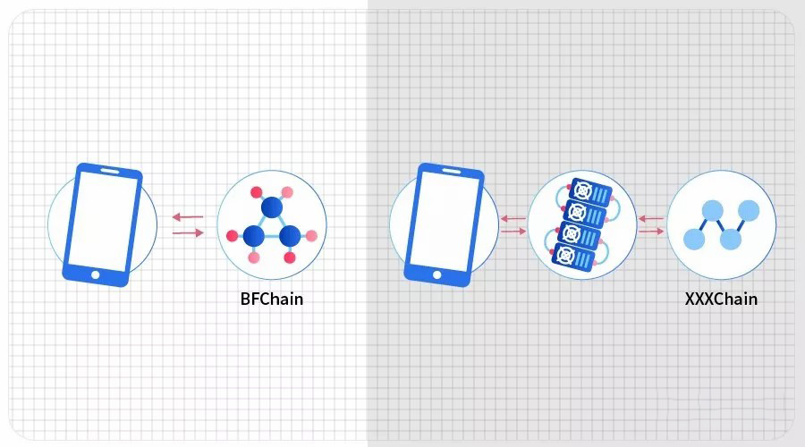
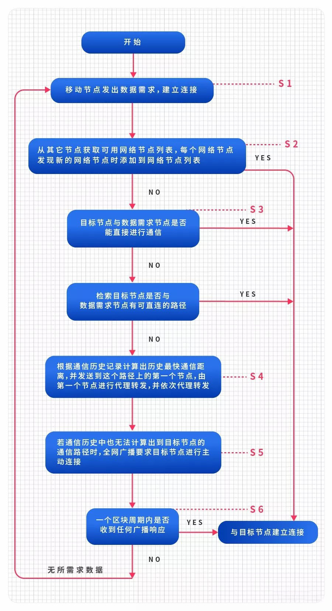
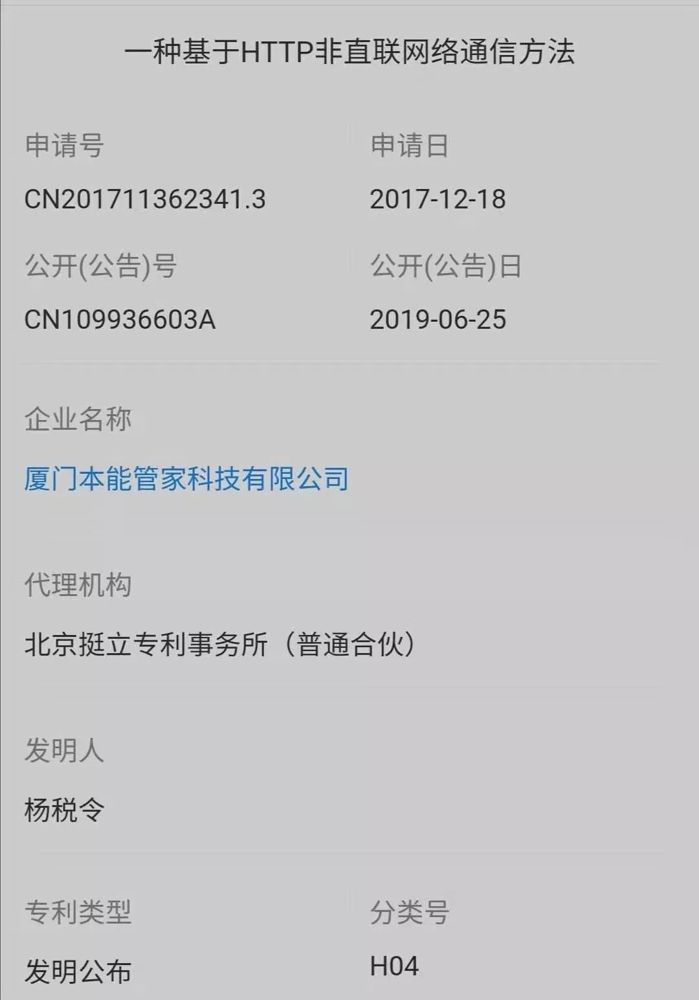

## BFChain首创的移动端点对点通信方案，到底厉害在哪？

  **1 移动端的**P2P通信**难点** 

区块链技术打破传统互联网的诸多限制，其中一点，是P2P（peer to peer，即点对点）的通信方式。目前，区块链已经很好地应用于PC端，但在移动端还很难实现P2P的数据传输。

                                 ▲ P2P网络示意图  

究其原因，是移动端各节点之间所处的网络、通信环境各不相同，目前使用的移动端区块链的网络连接方法无法实现**跨网段、跨网络、跨区域网络的通信**，**这也大大限制了区块链技术在移动端的发展。**

                              ▲移动设备的通信环境各不相同

  **2、现存的解决方案与效果** 

在这样的前提下，一些区块链项目声称实现了移动端的落地，实际上是通过在PC端和移动端之间建立**数据库服务器**协助通信，数据库服务器为移动端设备提供数据服务，并未实现移动节点之间的互联。在本质上，仍需要网络以外的第三方的中转，因此，仍然存在着**第三方篡改和控制数据的隐患**。

                   ▲移动区块链与传统区块链的连接区别

  **3、另辟蹊径的解决思路** 

另一方面，BFChain找到了独特的解决思路，我们可以将这一思路进行一个类比：

在互联网环境中，人与人之间是如何进行信息的传递的？以微信为例，当你可以与对方直接建立连接时，可以进行一对一的转发。但是，当对方在你的人际关系网以外，这时候，就需要借助别人帮忙转发，或者，需要通过你发送适用范围更大的“朋友圈”进行转发和连接。

这一方式的核心，在于通过网络内的多个其他节点，扩大通信范围并改变原来单一的通信、创造多维度的通信路径。

                                    ▲社交关系圈

  **4、BFChain的通信路径** 

我们可以通过一张图，查看BFChain的解决路径:

                            ▲BFChain网络通信流程示意图

具体来说，流程如下：

(1)移动节点发出数据需求，建立连接；  

(2)从其它节点获取可用网络节点列表，每个网络节点发现新的网络节点时添加到网络节点列表；

3)当目标节点与数据需求节点不能直接进行通信时，检索目标节点是否与数据需求节点有可直连的路径；

(4)若有可直连路径就发送到该直连路径上的节点进行代理通信，若没有可直连路径， 就根据通信历史记录计算出历史最快通信距离，并发送到这个路径上的第一个节点，由第一个节点进行代理转发，并依次代理转发；

(5)若通信历史中也无法计算出到目标节点的通信路径时，全网广播要求目标节点进行主动连接；

(6)若在一个区块周期内依然没有收到任何广播响应，那么认为该目标节点已掉线，返回数据需求节点，反馈无所需求数据。

上述BFChain为解决移动端P2P通讯问题的专利技术——《一种基于HTTP非直联网络通信方法》，已于2019年6月25日正式公开。

▲BFChain专利：《一种基于HTTP非直联网络通信方法》

#### **通过这一方式，BFChain解决了什么问题？**

在这一技术专利中，主要解决了两个关键的问题：

1.实现了移动节点跨通信条件、设备的通信传输

2.为各节点建立连接提供支持，并且找到最优通信路径

 **除此以外，这一解决方案还有以下几点优势** 

1.目标节点可**主动**连接到数据需求节点；

2.全网广播形式下游有**许多的传输节点负责传播数据需求**；

3.传输节点会**根据数据形式分配不同带宽**。

BFChain网络这一专利技术解决了移动端设备P2P连接、数据传输的难题，首次实现了区块链技术在移动终端上的应用 ，并创造出了**全球第一款可真正实现移动直连的移动区块链项目BFChain**。截止2019年9月，BFChain项目已有78项技术专利获得国家初审通过，引领着移动区块链的发展，更为移动区块链的落地奠定了坚实的技术基础。
