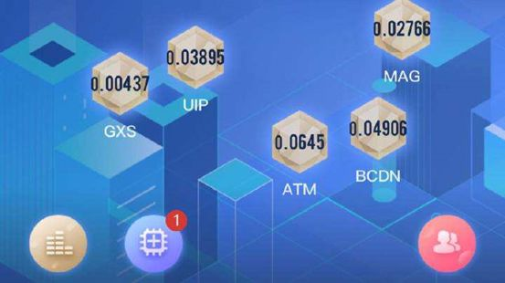
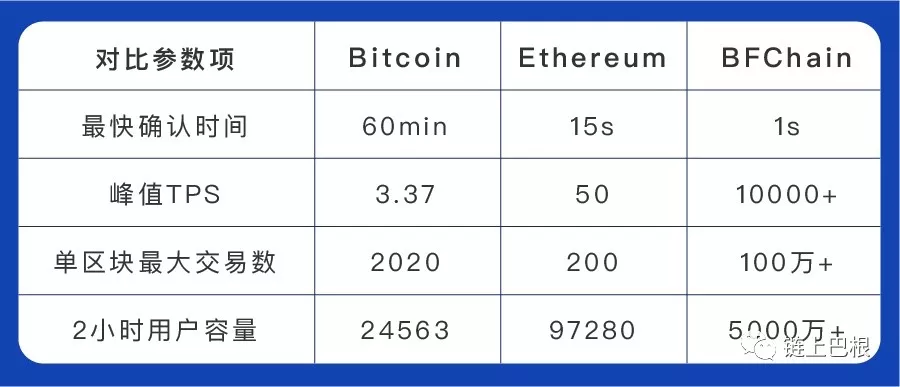

以下文章来源于蜂巢财经News ，作者凯尔、JX kin

[**蜂巢财经News**区块链真相派，用深度报道去伪存真](https://mp.weixin.qq.com/s/qGHSQnca_QdHgyOOg_kwag#)

9月底，比原链（bytom）创始人兼CEO段新星辞去职务，离开了他一直看好的公链舞台。在这半个月之前，另一老牌国产公链公信宝（GXC）的运营主体因涉及非法爬虫业务遭警方查封，一时令舆论哗然。  

两大公链相继发生变故，各自短暂地占领币圈“头条”的几天后，讨论声渐息。曾在2017年炙手可热的公链赛道陷入沉寂，**这块战场仍未诞生真正的“杀手级”应用，这是全球范围内所有公链都面临的尴尬，哪怕是最星光闪耀的以太坊和EOS，也未能突破想象。**

从2014年到2019年，五年时间，公链从探索阶段进入井喷期。**热闹过后，性能不足以支撑野心，商业应用和价值难以落地等难题依然没有得到有效解决**。

比原链创始人的离开再次提醒着行业公链正在走向发展断层，处在高不成低不就的尴尬区间。

市场上，新一轮洗牌夜以继日地进行，公链领域不时有新人涌现，Cosmos 和Polkadot（波卡）等跨链项目成为新的明星，迭代再次袭来。

### 公信宝暴雷 揭国产公链伤疤

9月11日晚间，“公信宝被查封”的消息不胫而走。后续多方信源证实，其运营主体杭州存信数据科技有限公司因非法爬虫和倒卖数据，被杭州市公安局西湖分局古荡派出所法办。

随后的几天时间，GXC币价大幅跳水，由0.76美元跌至最低0.29美元，跌幅超过60%。

公信宝成立于2016年，是币圈最早投入商业应用落地的公链之一。2017年6月，公信宝正式推出主网GXChain，2018年1月，公信宝发布了著名的DApp布洛克城，用户可以通过上传个人数据进行挖矿。

布洛克城挖矿页面  

在业内多数人看来，公信宝是圈子里为数不多的好项目，非法爬虫的“越界”事故还是揭开了这个明星公链的伤疤。

翻看公信宝过往的信息，其 CEO黄敏强多次强调，公信宝践行的是通过区块链将数据的所有权归还给个人，“隐私保护是自由世界的基础。”讽刺的是公信宝终因非法爬取隐私数据遭遇查封。

表面来看，爬虫业务和区块链业务并没有直接关联，但言行不一却让其遭遇公信危机，也暴露这条明星公链的造血能力不容乐观。

在DApp建设上缺乏创新和实际应用，本身的数据交易业务也仅局限于币圈这个小众群体里，加之币价不断缩水，公信宝的区块链业务并不好过。

其实，不只公信宝，各大已上线的国产公链如今的处境都不算乐观。不久前经历CEO离任的比原链现报价0.41元，相比历史高点8.35元，市值缩水95%；小蚁（NEO） 、量子链（QTUM） 、星云链（NAS）等国产公链市值也都跌超90%。

目前已上线的国产公链相对以往来说沉寂了很多。

### 两大经典公链遭瓶颈 性能不及需求

公链们的困境与天时地利人和都有关联。放在几十年后来看，这或许是时代所囿，毕竟最领先的公链都在品尝阵痛的滋味。

2014年，以太坊（ETH）横空出世，带来了划时代的去中心化智能合约。

原本，智能合约在金融衍生品、保险、房产等传统场景上已经有使用空间，而以太坊智能合约的“去中心化应用”又带来了无限想象力，它使得区块链的扩展性变强，人们在智能合约身上，看到了区块链超越Windows、Android等系统的可能性。 

创新之举带来了ETH的腾飞，以太坊成为“区块链2.0时代”的代表，占据了很长一段时间的霸主地位。

谁也没想到，想象力并未在现实应用中得到实现，借助以太坊发币融资成了它的“最强落地”。2017年，数不清的基于以太坊网络发行的Token项目诞生，也一举将ETH推向了募资“硬通货”的地位，ETH价格超过1万元，达到了历史最高点。

此后，**以太坊的问题也逐渐暴露出来，最令人难以忍受的是性能问题。TPS低导致了以太坊网络拥堵，DApp运行不流畅。此外，用户在以太坊网络上进行每一步操作，都需要支付gas费用，这让其使用门槛变得非常高**。

难题迟迟没有解决，以太坊跌落神坛。如今ETH报价1300元，相比历史高点跌去87%。

ETH币价跌幅达87%  

与以太坊一样，公链新势力EOS也没有逃脱“时代的束缚”。打着百万TPS旗号诞生的EOS，在一段时间内，凭借快捷的转账和操作体验，成为所谓“区块链3.0”的开创者。其DApp数量较以太坊虽少，但由于更好的体验，主导了一波Dapp大爆发。

结果，层出不穷的安全事故和博彩游戏充斥在EOS生态中，同样让传统开发者望而却步的依然是高门槛：以太坊只是要个gas费，EOS连CPU和内存都要收费。这也导致EOS面临着增长瓶颈。

作为区块链应用的基础设施、运行智能合约的载体，以太坊和EOS先后引领了公链的短暂繁荣后，也陷入困境。

**在一名业内人士看来，目前公链普遍遭遇的问题在于这个“基础设施”的性能对于外界庞大的需求来说，还是太过脆弱。无论是性能、安全性和灵活性上，都远不及中心化系统，公链没有完成质的进步，“技术还只是一个雏形**。

上述人士认为，公链们至少还需10年的时间来变革自身，“1985年，微软带来了Windows1.0操作系统，2000年互联网才大规模爆发。从以太坊算起，公链走过了5年，或许10年后，公链才能真正迎来属于它的时代。”

### 尝试不止 多公链试图破局

自去年熊市后，外界对公链唱衰的声音不绝于耳。不过，从各大公链的动作来看，行业内正进行着一轮更深层次的洗牌，它们纷纷用不同的方式尝试破局。或许将带来比2017年公链大战更为激烈的动作。

比如，ETH正积极地向着其2.0版本前进。9月13日，ConsenSys开发团队PegaSys的工程师Jonny Rhea在推特上宣布，以太坊2.0多客户端操作已经确认。预计在2020∼2021年正式带来以太坊2.0。在这期间，以太坊将会综合所有的技术优势，来重新打造POS链，ETH将以分片技术和虚拟机来实现性能上的突破。

EOS也在围绕其重量级DApp Voice做布局。9月23日，EOS刚刚完成了第一次硬分叉，升级至EOSIO v1.8版本。除了提升安全性能外，EOS支持开发者为用户支付资源费用，降低用户使用DApp的门槛，这或许能够为自家生态扩大用户入口。

EOS寄希望Voice破局  

除此之外，QuarkChain（夸克链）目前正在解决公链的灵活性问题。其CMO向亚贞认为，目前公链存在的问题是社区分裂、升级困难、算力分散、功能单一，归根结底还是不够灵活，公链开发方应该研发支持多种共识机制的公链。

在技术层变革之外，公链们也在应用层寻求突破。在火热的DeFi（去中心化金融）领域，ETH和EOS都在发力布局。根据The Block统计，ETH生态中目前已有上百个DeFi项目，EOS生态也有包括NewDex、EOSDT在内的DeFi项目。

国产公链中，Qtum、IOST等PoS项目也生态中推进Staking经济，在投资者服务上提供“存币挖矿”等功能。

尽管现阶段公链行业进展放缓，好在从业者都在探索破局之道。

经历了一轮泡沫后，一名公链创业者认为，公链进入了爆发前的蓄势期，虽然表面平静如水，内部却波涛汹涌，深度洗牌正在进行，蓄势后，公链会步入新的台阶，“从宏观角度来看，不必担心公链的‘断层’，它和时间一样一直在向前。”

（以上正文来源于 蜂巢财经）

—————————————————————————————

### 移动区块链观察 | 评论

根据上文表述的情况，移动区块链观察认为，公链之路要想破局，需要从以下三个维度来考量：

**1、顶层设计：** 如何从顶层设计出发突破思维局限，让这条公链能够站在更高的维度为商业应用与价值落地服务。  

之前移动区块链观察曾经多次撰文说明，必须打通区块链与广大用户之间最重要的桥梁——移动端，让绝大部分网民能够轻松使用智能手机直连链上，才能使得应用落地价值最大化。**我们认为，一条真正的移动公有链，对比其竞争对手将是降维式的打击，大家不在同一个维度竞争。**

**2、创业初心与长远规划**：公链创始团队拥有坚定不移的信念，秉持区块链世界的核心理念“解决信用问题”，同时在此指导下做好长远规划，不执着于短期利益，才能做好一条传世公链。  

就像在马云领导之下的阿里，其企业目标不是做更强，做更大，做最赚钱的公司，而是要做一家102年的企业。马云的一句话对创业者们有特别意义：“你能走多远，第一天的梦想很重要。”而公信宝为什么会倒，就与为了短期利益导致不择手段有重大关系。

**3、底层技术与友好开发环境**：性能、安全性、灵活性等问题正是阻碍现有已上线公链成为真正可用的基础设施的突出问题，必须得到解决。  

性能不足是以太坊面临的最大障碍之一，而高昂的开发成本也让EOS的DAPP生态裹足不前。作为基础设施的公有链，必须要在这些方面有突出表现才能赢得市场的青睐。

**在国内尚未主网上线的公有链项目中，有一条公链颇具破局者之势。**

全球首款移动端区块链BFChain生物链林，是目前世界上首个且是唯一一个实现移动端可直连链上参与治理的公有链。  

BFChain生物链林以建设信用时代为己任，定位为信用时代的基础设施，并且做了18年的建设规划。

经过四年埋首研发，截至2019年9月，BFChain已累积包括多维分片扩容技术、离线交易等在内的78项技术专利获得国家初审通过，TPS峰值突破10000+，远超Bitcoin、Ethereum两大经典区块链项目。

基于顶层设计的超越之处，和诸多底层革命性创新，相信未来以BFChain为代表的新一代公有链，将引领公链破局之路。

以上内容仅供参考，不构成任何投资建议！
