# 一文读懂区块链相较互联网的真正创新之处

原文标题：区块链 Vs互联网，创新在哪里？

引言：最近关于区块链革命的提法少了很多，我们很少再听到“区块链即将颠覆互联网”的提法，这似乎也寓意着区块链技术（加密技术）正在进入一个理性发展的阶段，如果按照Gartner的技术成熟度曲线来看，区块链正在进入一个泡沫幻灭的阶段，如之前再成熟度曲线中消失的“云计算”概念一样，区块链似乎正在成为一个IT行业的基础设施。数字经济时代，本文试图对区块链（本文中将加密Crypto与区块链blockchain视作等同概念）与互联网的内在关系进行一个梳理。

进入数字经济时代，所有数字服务均由数据库提供支持。区别于传统的中心化式数据库，加密技术开启了一种新的方式来构建和维护数据库，表现在，加密数字服务建立在一个由网络参与者社区运营的去中心化数据库协议之上。

在过去短短的几十年中，Internet已从早期的高度分散的技术架构转变为由几个强大的网络巨头（Google、Facebook、Microsoft、Apple、Amazon等）所控制的架构。很显然，这些互联网巨头造成了技术垄断，导致了开发人员的种种限制，并最终阻碍了创新。

加密协议本质上是一种开源协议（p.s.那些不开源的协议都是伪区块链），旨在打破这种高度集中式的体系结构，为开发人员提供一个公平的竞争环境，各种应用程序可以搭建在这些开放和无许可的协议上。

总览

1. 信息技术创新周期

2. 互联网的历史

3. API经济

4. 加密技术基础

5. 加密技术的潜力

6. 相关应用指标

### 1.信息技术创新周期

##### 新的计算平台支持新的应用程序

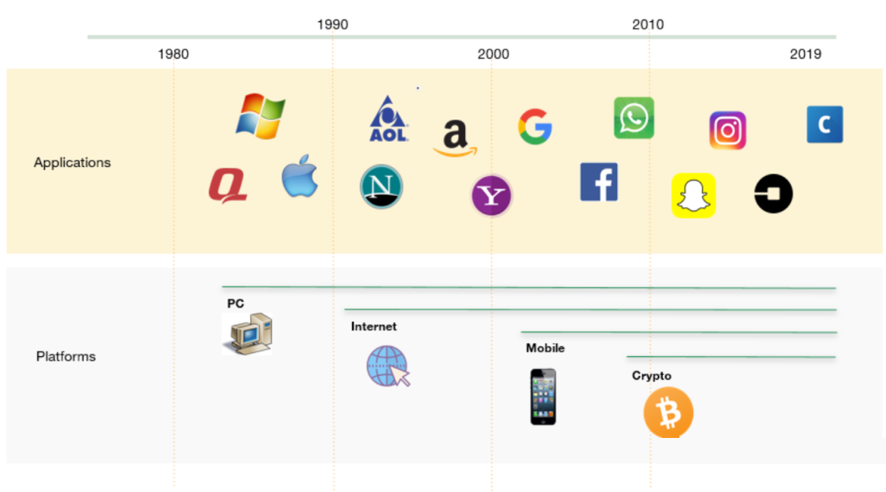

来源：克里斯·迪克森（Chris.Dixon），下一个计算是什么（2016） 。

·       **新的计算平台支持新的应用程序。** 新的计算平台提供了新的独特的功能，使开发人员和企业家能够重新设计整个行业。

·       **计算的范式转移。** 在1980年代，个人计算机时代使个人工具的创建成为可能，例如Word，Excel和其他桌面应用程序。进入1990年代，互联网通过提供全球信息分发网络将这些计算机连接起来，将先前的个人工具转变为协作服务，例如搜索引擎Yahoo，社交网络Facebook和电子邮件。移动互联网时代，智能手机使这些服务更加移动化、无处不在，增加了摄像头和GPS功能，诞生了诸如Snapchat、wechat等移动互联网巨头。

·       **Crypto加密是基于Internet原生金融的新计算平台。** 2000年以后，BTC为代表的的加密资产的诞生加密资产使金融交易具有类似电子邮件的效率。一个共同维护的开放式数据库促进了这些加密资产的交易。作为互联网的原生技术，加密应用程序从第一天开始，就可以在全球范围内实现分发，诸如Coinbase、Binance等应用也使得这些加密资产交易能够更便利。

##### 一开始的时候总像个玩具

来源：卡洛塔·佩雷斯（Carlota Perez），《技术革命与金融资本》（2003）。

·       **下一件大事在一开始的时候，总像个玩具一样。** 每种新技术在进入主流应用阶段之前都要经过早期适用到投资阶段。在这个阶段，风险资本参与投机并驱动技术创新，将大量人才和资本吸引到这个新兴市场，在发展多年后，这项技术或可得到大众的认可并成为主流。

·       **一个新的计算平台总是在某个方面上表现出色，而在其他方面则很糟糕。** 最初，新技术无法满足用户的需求，像个玩具。通常，人们倾向于低估新计算机平台上的创新速度。比如，一开始的时候，智能手机被当做小型且缓慢的计算机，但如今，它们已胜任大多数的计算机运算。

·       **我们仍处于加密的“玩具”阶段。** 加密技术的新功能是一个可以集体维护的、开放和全球化数据库，从而消除了对可信第三方的需求。加密网络的交易处理能力仍然受制于各种性能限制。但我们经常忽略的是，即使在早期，加密技术已经吸引了一些来自互联网的最优秀开发人员参与其中。

##### 开源软件促进创新

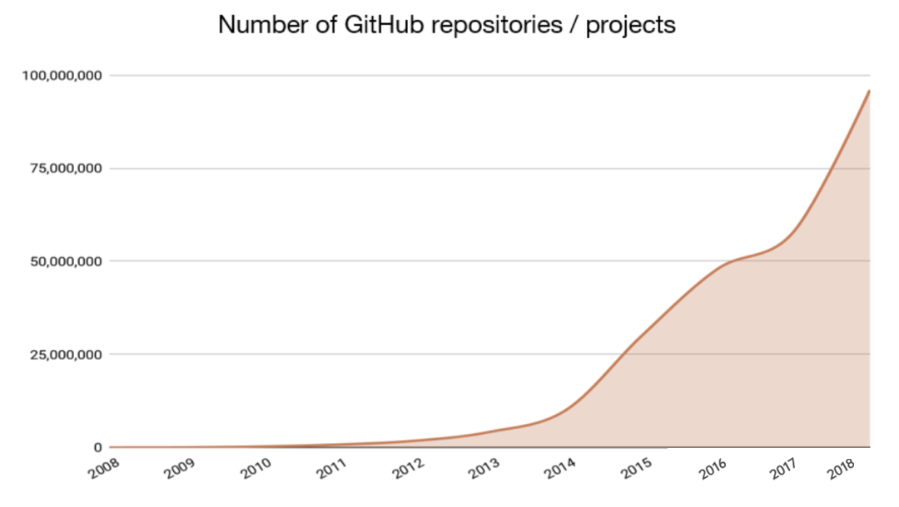

来源：Github Octoverse。

·       **开源软件促进了创新。** 开源软件运动是由一群研究人员在1980年代发起的技术浪潮。如今，已经会有97％的企业使用开源软件。例如，Android基于最流行的开源操作系统Linux构建。2018年，IBM以334亿美元收购了Red Hat，微软去年以75亿美元收购了Github。

·       **开源软件使整个技术行业受益。** 任何人都可以参与开源软件的贡献和改善之中，这种开源化运动促进了技术的快速创新，开发人员可以将现有软件无缝整合到他们的产品和服务中。

·       **加密技术可以实现全球范围内的开源开发协调。** 开源运动代替了传统企业下的协调和经济上来激励开源软件的开发，加密技术可直接从协议中实现软件的货币化。内嵌的经济激励措施可以促进开源开发人员的积极性。我们也注意到开源在全球范围内的蓬勃发展。

Open Source Contributions in US and the Rest of World

来源：Github Octoverse。  

### 2.互联网的历史

##### 互联网最初只是一个研究项目，初衷也是创建一个开放的，去中心化的通信网络。

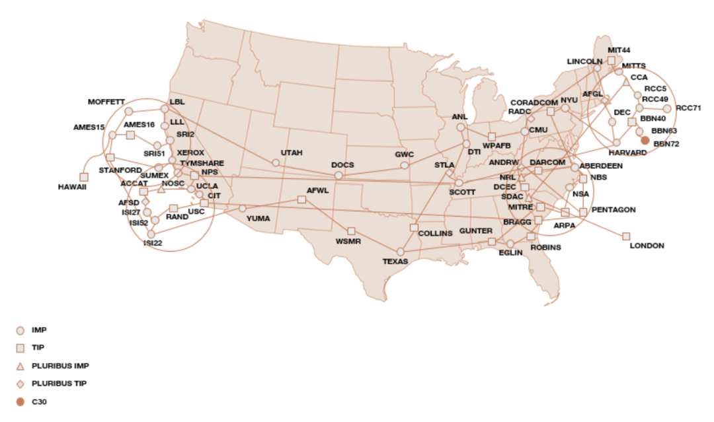

来源：布莱恩·麦卡洛（Brian McCullough），《互联网如何发生：从Netscape到iPhone》（2018年）。

·       **互联网最初是一个研究项目，初衷是创建一个开放的，去中心化的通信网络。** 该计划一开始由政府和学术界资助。目的是创建一个没有任何单点故障的通信网络。商业互联网是建立在这种网络架构之上的。

·       **互联网无处不在，因为其底层网络是开放的和去中心化的。** 开放通信标准为全球的信息传输提供了一个共享的技术基础架构。任何人都可以以一种无许可的方式加入，与应用程序通信或将应用程序部署到全球网络。

·       **加密是互联网的一个开放金融通讯网络。** 加密可以实现全球金融基础设施，而不会出现单点故障。任何人都可以在共享基础架构之上，部署及使用各种金融应用程序。开放的金融基础设施真正地实现了无授权的创新。

##### 早期的Internet协议仅仅是个通信渠道

来源：Wikipedia，Internet协议套件。

·       **早期的互联网协议仅仅是个通信渠道。** 协议定义了Internet上计算机之间的通信标准。这些TCP/IP等协议用于所有Internet通信中，以确保信息可以快速可靠传输。不同类型的信息需要不同的协议：Web请求（HTTP），电子邮件（SMTP），语音（VoIP）等。

·       **Internet协议受到限制，因为它们无法存储状态。** Internet协议能够传输信息，但无法存储信息。这意味着通信永远不能建立在先前发送的信息上。通过这些协议进行的通信缺乏上下文。

·       **在加密协议之前，Internet上任何有意义的活动都需要第三方（Google、Facebook等）参与。** 记录信息（状态）的能力是构建Internet应用程序的先决条件。一直以来，不少私有公司参与维护了这些用于通过Internet协议进行通信的数据库。

##### Internet协议要求私有第三方数据库发挥最大潜力

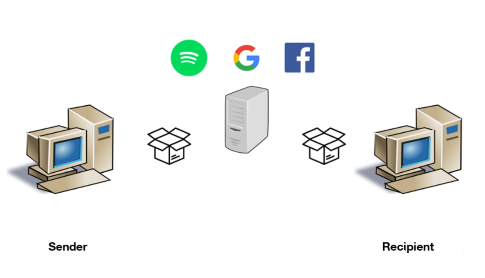

来源：本·汤普森（Ben Thompson），《聚合理论》（Aggregation Theory，2015年）。

·       **Internet协议要求私有第三方数据库发挥最大潜力。** 所有Internet服务都依赖于第三方存储来自先前活动的数据的能力。例如，如果不访问先前建立的联系人，就无法维护用户社交网络的记录。

·       **汇总数据的巨大潜力。** 私有数据库在Internet上进行记录活动。此数据经过过滤和排序，以创建用户友好的应用程序。用户体验越好，服务吸引的用户就越多，从而又收集到更多的数据。这种模式导致了一个正向循环-**少数技术公司成为事实上的数据垄断者。**

·       **加密协议将数据存储在集体维护的数据库中。** 加密协议可用作应用程序的开放数据库。它不是在公司层面上汇总数据，而是在协议层面上汇总数据，并成为共享的基础结构。应用程序和用户都可以利用同一数据存储源，并从中受益。

##### 数据垄断者成为互联网的守门人

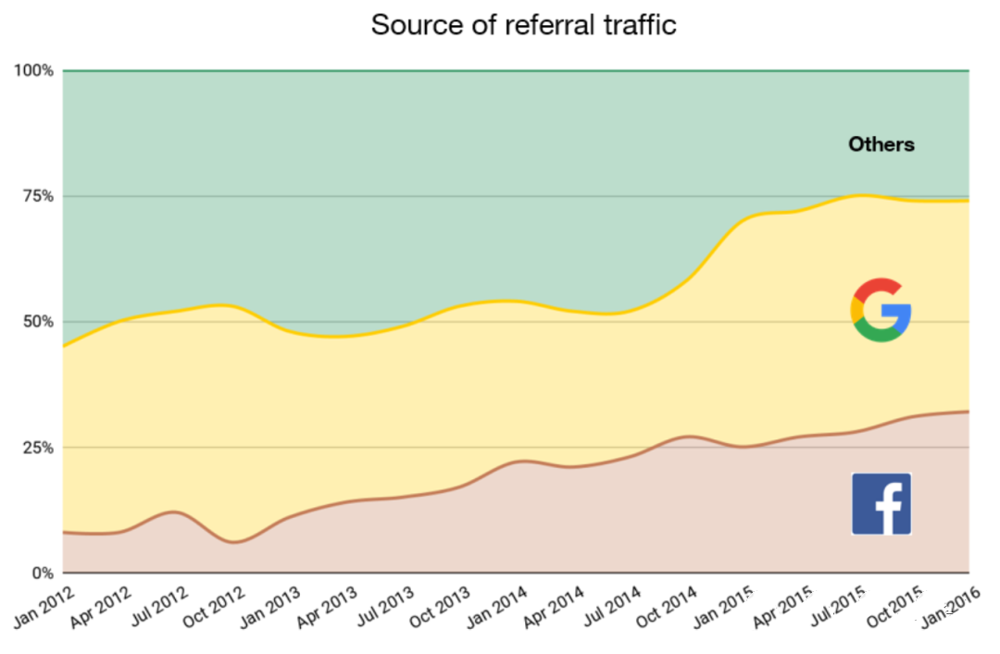

来源：NFX，《网络效应手册：13种不同的网络效应》（2018年）。

·       **数据垄断成为互联网的守门人。互联网**最初是一个分散的网络，但现在实际上变成了由少数大型技术公司所控制的网络。Google和Facebook现在对所有互联网流量的直接影响超过70％以上。由于这种影响，初创公司将拿出40%融到的VC资金，花在Google，Facebook等流量巨头上来获取新客户。

·       **网络效应，用户发现产品叠加了一些有价值的服务。互联网**技术公司巨头（GAFA）能够为其用户提供数十亿相关交易对手（用户，供应商，客户，服务提供商等）的网络。另外，由于他们已经积累了用户数据，他们能够更容易提供更好的用户体验。

·       **垄断扼杀了互联网上的创新。** 这些技术巨头曾经尝试竞争，这种竞争可以使互联网市场变得多样化。但如今，这些公司中的大多数控制着互联网各自擅长的部分。结果是，用户正在失去选择的权利。

##### 缺乏原生支付层为Internet上可能的业务模型设置了限制

来源：康妮·陈（Connie Chan），《广告还不够》（2018年）。

·       **缺乏原生支付层为Internet上可能的业务模型设置了限制。** 如今，公司通常专注于注意力经济或钱包经济。前者通常是强调互动并通过广告获利的数据市场（Facebook，Twitter，Snapchat），而后者通常是通过交易（Amazon）和/或订阅（Spotify，Netflix）获利的内容和产品市场，互联网公司的主要收入来源已经相当集中。

·       **传统的支付方式会损害Internet上的用户体验。** 越来越多的广告使得许多应用程序和服务难以使用。广告的精准定位也会损害用户的隐私权，而且通常是恶意软件插件。基于订阅的收入模型将用户锁定在一大批的服务产品中，每月或每年的订阅计划或损害用户的权益-许多人即使不再使用该产品或服务后却往往忘记取消订阅。

### 3.API经济

##### 领先的技术公司都是平台

来源：Scott Kupor，《初创企业，平台和创新》（2019年）。

·       **领先的技术公司都是平台。** 它们是连接用户和服务的双向市场。平台因为网络效应和用户生成的内容而得到发展。对于服务提供商来说，平台可帮助其实现低成本地获取用户。对于用户而言，平台负责提供了高质量服务提供商的对接。

·       **平台是具有资本效率的业务模型。** Uber是最有价值的出租车公司，没有一辆车。Airbnb是最大的酒店服务，没有任何房地产。Spotify是音乐市场，所有内容均由艺术家产生。Youtube是最大的视频流媒体服务，没有自己生产的内容。平台提高资本使用的效率，过往伟大的互联网公司大多都是平台型。

·       **平台依靠网络效应和用户生成的内容生存，而不会奖励其用户。** 平台的典型生命周期是筹集VC风险资本资金，以获取用户并增强其网络效应。反过来，平台的用户会使服务对新服务提供商和用户更具吸引力。一旦平台达到足够大的规模，公司就可以躺赢-永久地提取平台活动的佣金。

##### 平台与第三方的关系可以随着时间的推移而变化

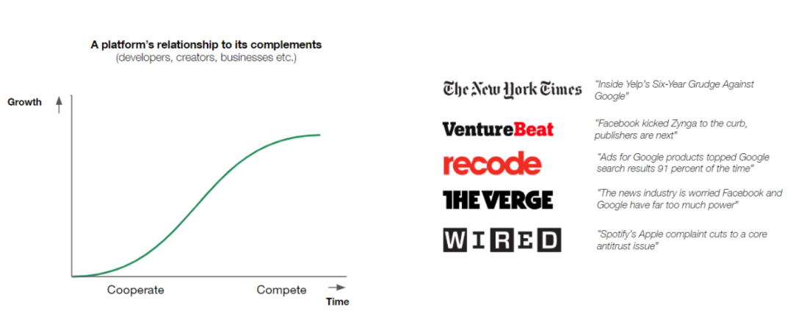

来源：克里斯·迪克森（Chris Dixon），《为什么权力下放很重要》（2018）。

·       **平台与第三方的关系会随着时间的推移而变化。** 成功的平台在应用过程中往往遵循上图类似的模式。随着平台应用的S曲线的增加，它们对用户和第三方的控制权也稳步增长。当平台到达S曲线的顶部时，他们与其网络参与者的关系从合作变为竞争。

·       **中心化式平台始于招聘人员，最终成为价值榨取者。** 刚开始，平台需要招募用户和第三方补充，例如开发人员，企业和媒体组织，以使其提供服务对用户更有价值。一旦平台达到临界规模，业务发展的自然之路就是与其合作伙伴竞争市场份额。

·       **平台天然倾向于扼杀创新。** 对于第三方角度来看，从合作到竞争的过渡使得双方很难维持可持续的业务伙伴关系。这种平台风险的典型例子诸如Spotify与Apple的交恶，其中Apple被指控在App Store中不公平地推广自己的音乐服务。

##### 应用程序依赖其他多个服务提供商的API访问来实现其核心功能

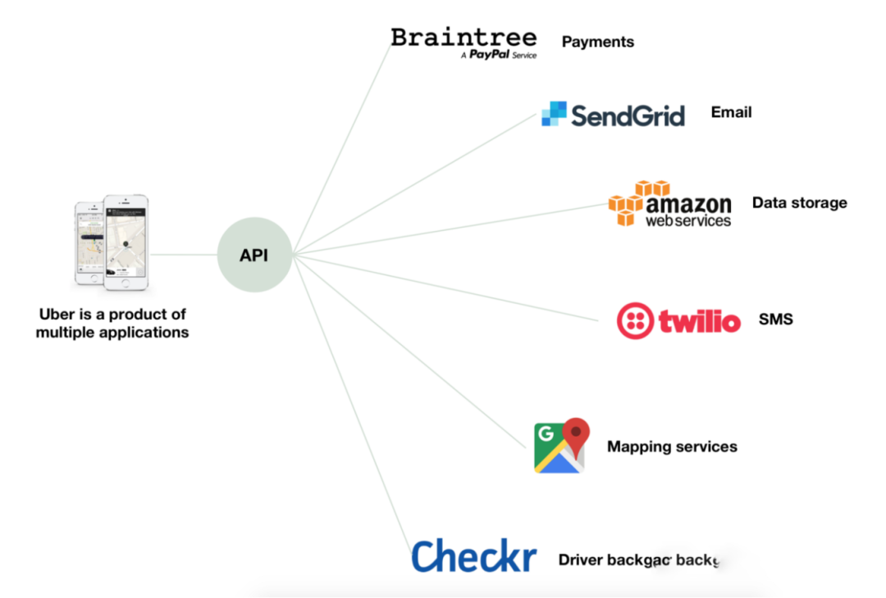

来源：马丁·卡萨多（Martin Casado），《通过API的世界》（2018）。

·       **应用程序的核心功能依赖于其他多个服务提供商所提供的API访问。** 应用程序不是孤立运行的。相反，它们通常连接到多个外部服务提供商的数据库API。

·       **模块化对于技术公司是互惠互利的。** 从头开始构建许多功能通常是不切实际的，这就是为什么公司倾向于依赖其他服务提供商来实现其许多核心功能的原因。

·       加密协议通过提供更便宜，更可靠的服务来代替传统的API。API访问维护成本很高。例如，Uber在2016年至2018年期间支付了5800万美元的使用Google Maps的权利。API提供商的单方面更改数据访问权的权利给第三方应用程序开发人员带来了固有的平台风险。但如果建立在加密协议之上时，开发人员不必担心数据访问权限的突然变化。**开放的基础架构消除了第三方开发人员的平台风险。**

### 4.加密技术的基础

##### 加密协议是新的互联网基础架构

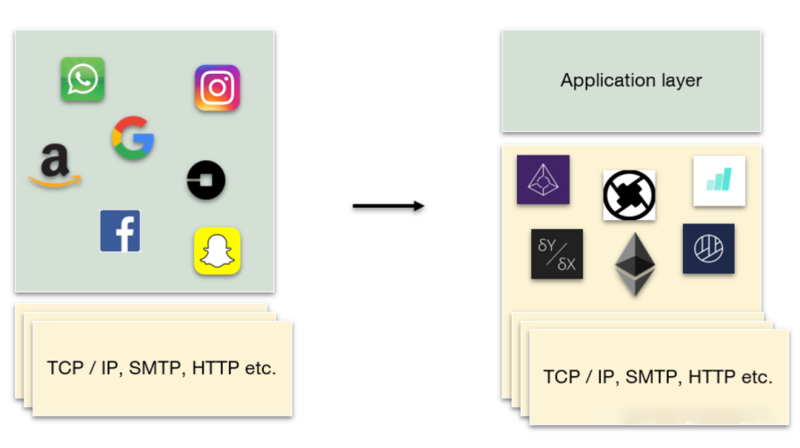

来源：Emre Tekisalp，《了解Web 3 —用户控制的Internet》（2018）。

·       **加密协议是新的互联网基础结构**。 加密协议将开放数据层添加到当前的Internet协议套件中。公司以前执行的业务逻辑现在可以直接在协议中进行编程。加密协议由在线参与者的网络（而不是中心化公司）拥有，维护和操作。

·       **加密协议是开发人员可以在其上构建的无许可平台**。开发人员现在可以通过不受中心化式公司控制的API在共享数据层上构建其应用程序。应用程序和用户具有对共享数据存储的平等访问权限。

·       **加密协议为开发人员提供了复杂的构建块**。共享的可编程数据层使得开发应用程序更快，更节省资金。此外，它消除了中心化平台所固有的平台风险。

##### 十年来，加密货币已从极客论坛帖子发展为大型机构认可的资产类别

来源：纳撒尼尔·波普尔（Nathaniel Popper），《数字黄金》：比特币和试图重塑货币的不满和百万富翁的内幕（2016）。

·       **十年来，加密货币已从极客论坛帖子发展成为机构资产类别**。比特币协议规范最初于2008年发布。2013年开始，有风险资本对加密技术进行了重大投资。2015年以太坊的推出引起了许多开发人员的注意，并为加密应用程序开发打开了一扇窗。

·       **互联网本应具有原生的支付层**。类似于网页的“ 404未找到”错误，Internet错误代码规范中存在“ 402需要付款”错误。在1990年代，互联网的创建者曾期望Internet集成数字支付层，但一直无法解决在没有受信任的第三方的情况下来维护全球数据库的技术难题。

·       **加密将付款转换为Internet数据包**。类似于互联网启用无权限信息传输的方式，比特币启用无权限值传输。任何连接到互联网的设备都可以自由参与比特币网络。

##### 比特币协议为其参与者提供了经济激励，以维护一个全球开放的数据库

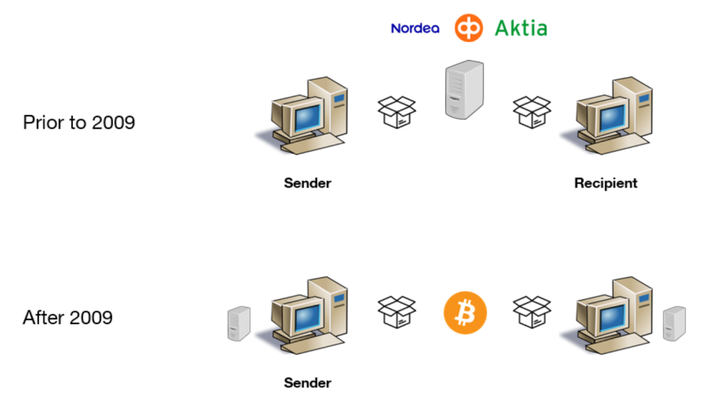

来源：中本聪（SatoshiNakamoto），比特币：点对点电子现金系统（2008）。

·       **比特币协议为其网络参与者提供了经济激励，促使其可以维护全球开放的数据库。BTC**网络参与者（矿工）争夺在比特币网络中验证交易的权利。通过诚实地更新和维护数据库，各参与者将获得比特币奖励。

·       **比特币协议是绕过中介的解决方案**。无需信任的第三方，Internet上的资金就变得安全了，跨境交易变非常有效率。

·      **消除传统金融基础设施所存在固有的摩擦**。所有银行都需要维护自己的内部交易数据库。比特币通过充当单个、共享和开放的交易数据库，提供了一个替代解决方案。事实上，现在我们都可以像电子邮件一样高效地在全球范围内发送和接收资金。

### 5.加密技术的潜力

##### 以太坊可以创建智能合约

来源：以太坊，下一代智能合约和去中心化应用平台（2014年）。

·       **以太坊可以创建智能合约**。智能合约是内嵌在以太坊区块链中。智能合约的预编程功能可帮助任何人实现交互和交易。

·       **开发人员意识到可编程货币的潜力**。比特币被认为是一个能够执行简单功能的计算器，而以太坊更像是一台计算机，能够实现任意复杂的交易逻辑执行。

·       **智能合约扩展了加密应用程序的设计空间**。智能合约是应用程序的构建块，可以部署在全球和开放数据层上。由于软件只是简单地将人为编译为机器可读的格式，因此开发人员能够将这些约束条件下任何形式化的想法部署到应用程序中。

##### 以太坊的可编程性导致智能合约开发的爆炸性增长

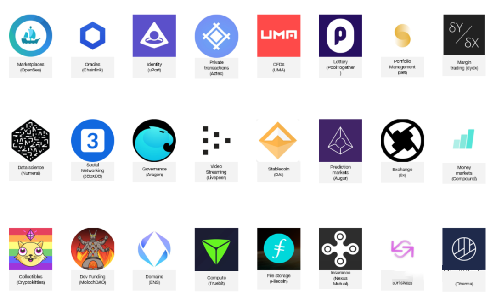

来源：dApp.com。

·       **以太坊的可编程性导致智能合约开发的爆炸性增长**。开放金融工具DeFi（用于贷款，衍生工具，交易所等）无需受信任的第三方，是用户可以交互的金融程序。核心Internet基础结构（存储，计算，视频转码，内容交付等）的开放市场使得任何用户都可以直接从其他网络参与者提供和使用计算资源。

·       **加密世界为开发人员和技术创业者们提供了无与伦比的机会。加密技术**为开发人员提供了一个可以从头开始重建金融和互联网基础结构的工具。应用程序的未来潜力，再加上新的开源软件的货币化，已吸引了越来越多的开发人员进入该领域。

·       **下一代Internet应用程序将建立在加密协议之上**。加密协议所提供的独特功能使一些新的Internet应用程序得以构建。与互联网创业者在开放的Internet协议之上建立新业务产品的方式类似，加密协议使得开发人员也可以重新设计现有行业并建立一个全新的领域。

##### 去中心化应用程序将加密协议用于其核心功能

来源：https：//www.argent.xyz

·       **去中心化的应用程序将加密协议用于其核心功能**。与传统的互联网公司依赖第三方API访问的方式类似，基于加密协议构建的应用程序也可以实现相似的访问功能，同时，不会带来平台风险。

·       **开发人员可以在没有平台风险的情况下进行构建**。开发人员无需依赖第三方API，就可以最大程度地降低其基础架构风险。与当前的应用程序开发环境不同，加密协议会产生经济激励，从而阻止数据孤岛。取而代之的是，开发人员出于经济上的动机创建了可以轻松与其他协议和应用程序集成的协议，以增加流量和自己协议的使用。

·       **加密协议的模块化和可组合性导致了快速创新**。由于开发人员能够在现有后端基础架构之上部署应用程序，因此，如何创建引人注目的用户体验成为应用程序之间的主要区别所在。例如，可以通过创建连接到提供相关原生的加密金融（例如交易所，借贷和/或衍生产品）的用户界面来有效地构建一个去中心化的银行服务。

##### Augur：预测市场的协议

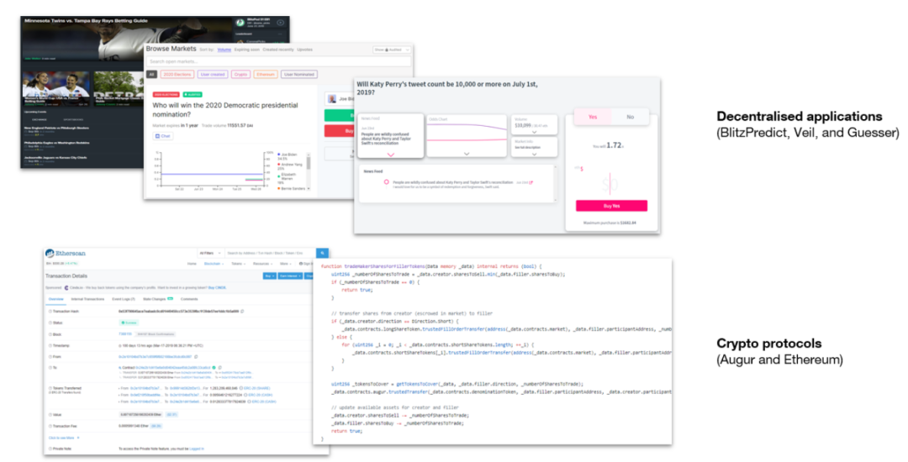

来源：Augur，一个去中心化的Oracle和预测市场平台（2018）。

·       **Augur：是一个用于预测市场的协议**。Augur协议允许任何人创建，交易和验证预测市场的结果。预测市场可以用来押注事件，预测未来事件的可能性以及对冲风险。

·       **Augur提供了一个进入任何金融市场的廉价的全球性途径**。拥有Internet连接的任何人都可以参与并创建Augur市场。该协议包含内置的经济激励措施，鼓励网络参与者以最低的费用运营市场。

·       **去中心化的应用程序基于Augur的功能，并为消费者提供用户界面**。去中心化的应用程序可以为用户挑选有趣的市场并对其进行过滤。由于交易执行和结算都直接发生在协议中，因此用户不必依赖受信任的第三方来保管其资产即可参与Augur市场。用户不必依赖单个公司的安全性，而可以从基础协议的全球网络安全性中受益。

##### 价值创造和价值获取将从公司股份转移到协议的Token

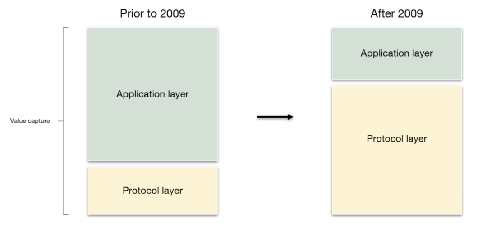

来源：乔尔·莫内格罗（Joel Monegro），《胖协议》（Fat Protocols，2016）。

·       **价值创造和价值获取将从公司股份转移到协议Token**。加密协议能够执行以前由中心化公司执行的许多增值功能。

·       **加密协议通过为其提供的功能收取费用来聚集价值**。由于加密协议可以为消费者创建更好的服务（更便宜，更快和更安全），因此它们很可能捕获Internet上发生的所有金融活动中的大多数价值。

·       **加密协议代表了自互联网以来信息技术领域的重大革命**。加密协议可能以与TCP / IP或SMTP相同的方式变得无处不在，这些都是当今所有主要Internet应用程序所依赖的协议。但是，与TCP / IP或SMTP相比，加密拥有共享的底层协议，就有可能促使它们在未来所有流量中获得相关经济利益。

### 6.相关应用指标

##### 以太坊开发框架Truffle的每月下载量

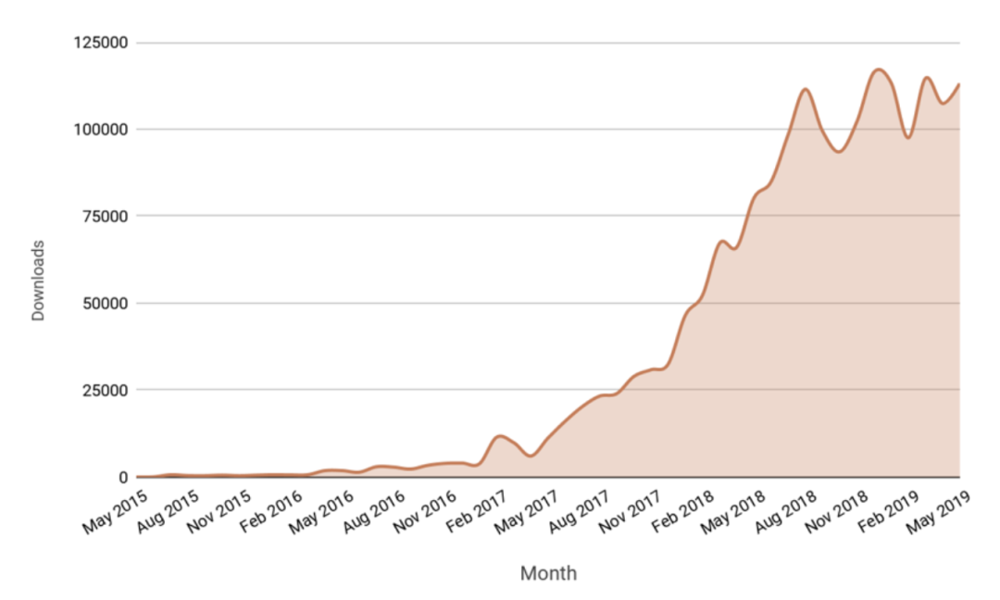

来源：Truffle.com，Developer Suite下载。

##### 在以太坊网络上支付的每日交易费用

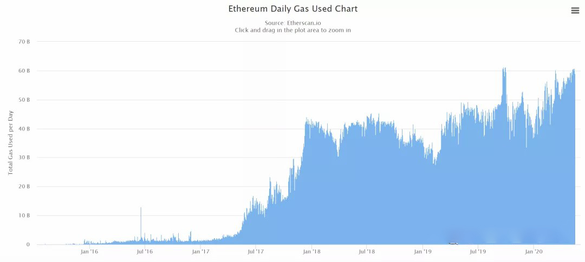

来源：Etherscan.io，以太坊每日使用的gas费。

##### 比特币/以太坊网络上的每日交易计数

来源：Bitinfocharts.com，《每日比特币/以太坊的确认交易》。

##### 每年在Coinbase上的注册用户数

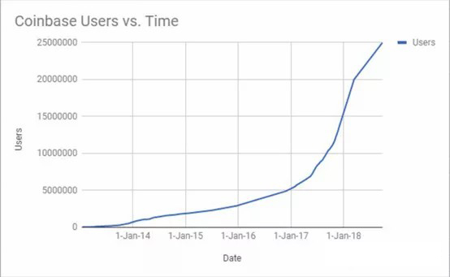

来源：Alistair Milne，Coinbase数据。

##### ETH锁定在去中心化金融协议中

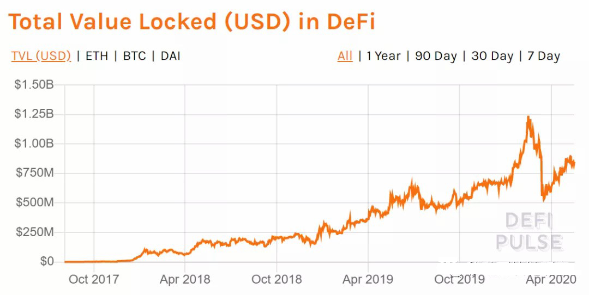

来源：defipulse。

##### VC风险投资资金进入加密行业

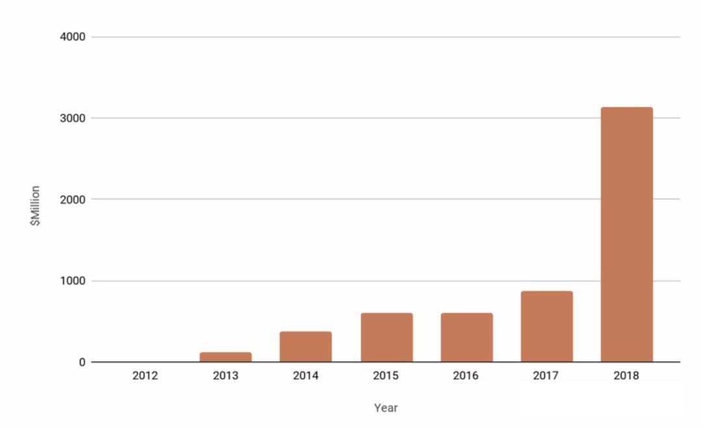

来源：Coindesk，Blockchain Venture Capital。

##### 不同类型的货币资产持有价值

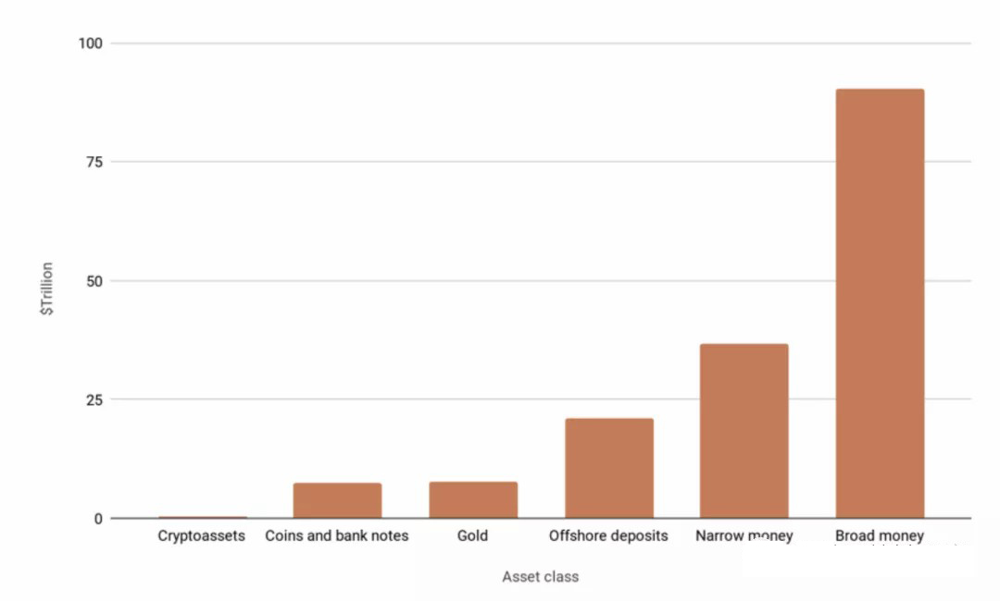

来源：Marketwatch，《全球所有货币合计图表》（2017年）。

##### 全球互联网，智能手机和电子商务渗透

来源：本尼迪克特·埃文斯（Benedict Evans），《开始的尽头》（2018年）。

##### 机构参与

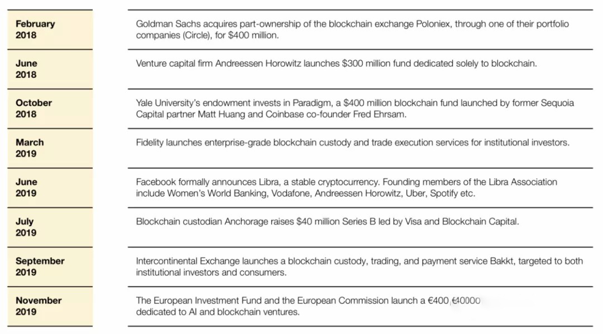

来源：《财富》杂志的Andreessen Horowitz向加密货币基金注资3亿美元；耶鲁大学及彭博社募集资金4亿美元投资加密货币基金；富达进军数字资产; 洲际交易所ICE参与投资Bakkt 等。

本文来源：共识未来
